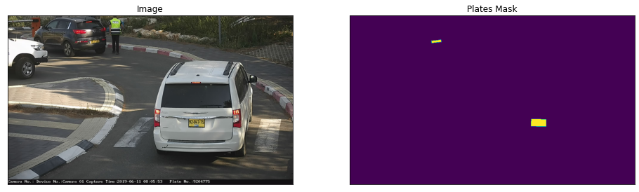
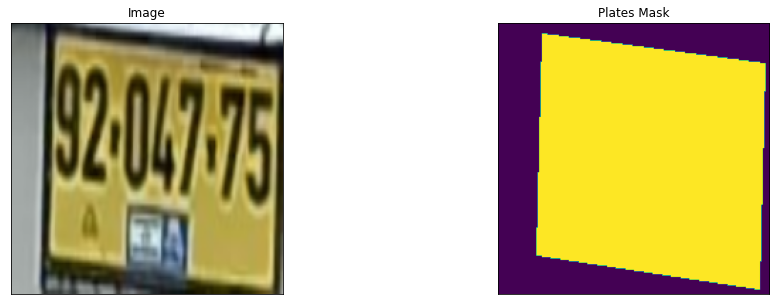
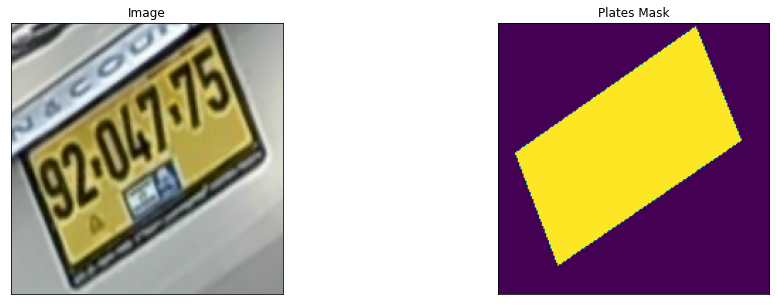
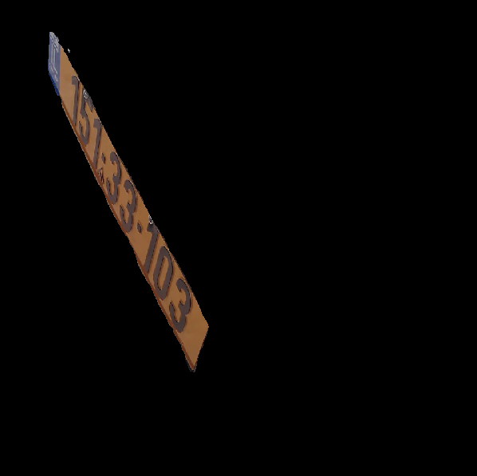
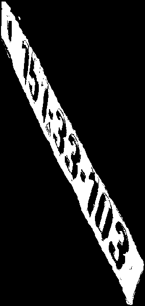
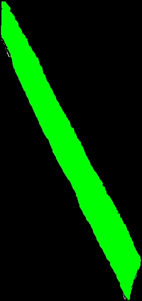
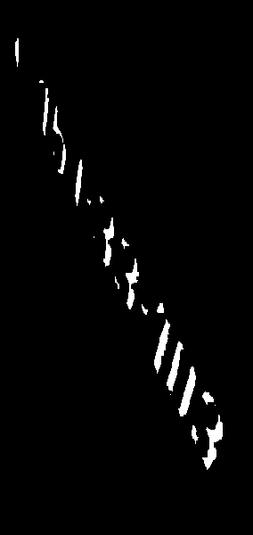
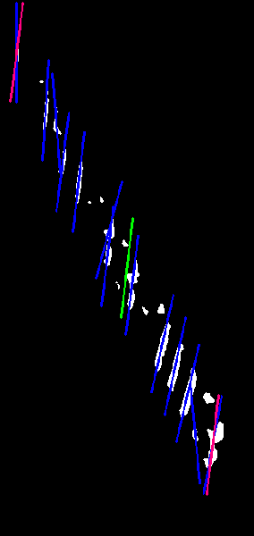
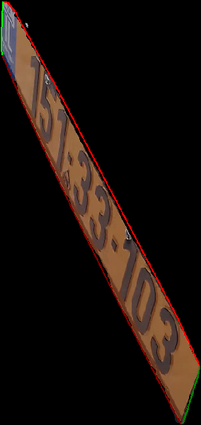
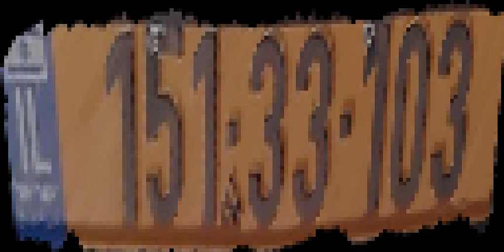

 
**License plates segmentation and rectification project**

The main features of this project:

 - Google Colabs training code for License Plates segmentation DL-models (based on [Segmentation Models Pytorch](https://github.com/qubvel/segmentation_models.pytorch), using [Pytorch Lightning](https://www.pytorchlightning.ai/) as a framework)
 - Python code for rectifying detected plates (using [OpenCV](https://opencv.org/)) into flat images to be read by OCR models later
 - Helper function converting CoCo (and [Via](https://www.robots.ox.ac.uk/~vgg/software/via/)) annotations into masks
 - Helper funciton optimising Pytorch and Lightning models into TensorRT scripts
 

### 📋 Table of content
1. [Training models](#training)
2. [Rectifying masks](#rectifying)
3. [Helper scripts](#helper)
    1. [Annotation converters](#convert_annotation)
    2. [Models converters](#convert_models)
4. [License](#license)

### ⏳ Training models 

Two Colab notebooks are provided to train segmentation models for License Plates: [lpr_seg.ipynb](lpr_seg.ipynb) and [lpr_seg_crops.ipynb](lpr_seg_crops.ipynb)

The former one trains a model for full-scale images with possibly several license plates on every image. It only requires a train set of images and masks to be operational.

The latter one uses the same images but applies a custom augmentation to them: it randomly rotates an image by a small angle, then randomly crops only one license plate from its bounding box with a random padding from each side, then rescales the obtained plate to 192x192 image, and finally generates a high precision mask. This notebook requires a set of images plus a CoCo 1.0 json annotation file with precise coordinates. It doesn't use masks.

#### Disclaimer: Notebooks demonstrate excertps of the dataset used, but this project does not provide the actual dataset. You will have to find or collate your own dataset to train your models. There are several open LPR datasets available on the Internet.

### 💡 Rectifying masks 

Rectifying is achieved in several stages of filtering.

1. Given the original image with the mask applied.

2. Threshold it several times.

3. Then separate the main component to remove noise.

<td>
    <tr></tr>
    <tr></tr>
    <tr></tr>
</td>

4. Then separate digits (optional).

5. Determine their directions (optional).

6. Directions are used to split top/bottom/left/right sides of the mask.

<td>
    <tr></tr>
    <tr></tr>
    <tr></tr>
</td>

7. Which are then used to warp-rectify the image.

Script [rectify_bundle.py](rectify_bundle.py) is used to rectify images from a directory and provided as a usage example. Script [rectify_one.py](rectify_one.py) takes one image and one mask with possibly multiple License Plates and slices it into crops. Then it calls [get_corners.py](get_corners.py) on each of them. The latter two could be applied to your use-case.

### 📦 Helper scripts 

#### 1. Annotation converters 

Script [helpers/annotation2mask.py](helpers/annotation2mask.py) converts Via annotations into masks.

Script [helpers/coco2crop.py](helpers/coco2crop.py) converts CoCo annotations into crops of individual License Plates.

Script [helpers/coco2mask.py](helpers/coco2mask.py) converts CoCo annotations into masks.

Script [helpers/mask2crop.py](helpers/mask2crop.py) converts masks into crops of individual License Plates.

Script [helpers/pascalmask2mask.py](helpers/pascalmask2mask.py) converts masks in Pascal VOC format to normal masks for training.

#### 2. Models converters 

Script [helpers/lightning2model.py](helpers/lightning2model.py) converts Pytorch Lightning model to normal Pytorch.

Script [helpers/model2trt.py](helpers/model2trt.py) converts normal Pytorch model into TensorRT model.

There are more utils in the [helpers/](helpers/) directory, which the reader can explore.

### 🛡️ License 
Project is distributed under [MIT License](LICENSE)
